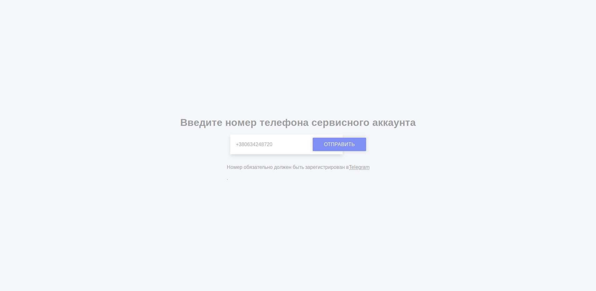
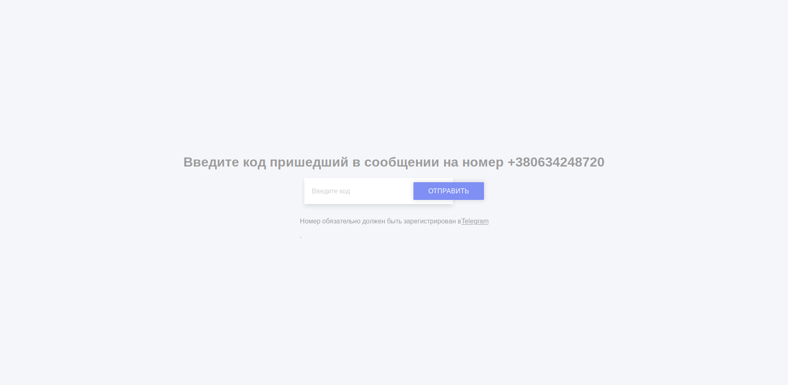
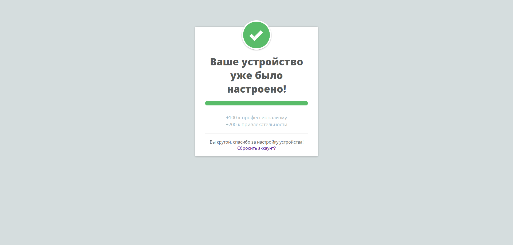

# Настройка сервисного аккаунта Telegram
Настройка сервисного этапа происходит в несколько этапов.
1. Ввод номера телефона
2. Ввод кода, который пришел в сообщении или в Telegram, или в СМС
3. Вы прекрасны!

Для упрощения этого процесса, после подключения устройства к сети,
зайдите на его IP-адрес, который был выдан вашим роутером, на порт 5000 (например `192.168.0.1:5000`)

>Ввод номера телефона

Подождите, пока устройство отправит запрос на вход в ваш Telegram аккаунт.

>Ввод кода, пришедшего в сообщении

После ввода кода, подождите 10-ть секунд, устройство попытается залогиниться, в Telegram

>Страница ожидания

В случае успешного входа, вы увидите данную страницу, которая укажет на то, что все было сделано правильно!
Если вы увидите данное окно, но устройство работает неккоректно, неообходимо провести [сброс устройства](howto/backup)

>Успех!
