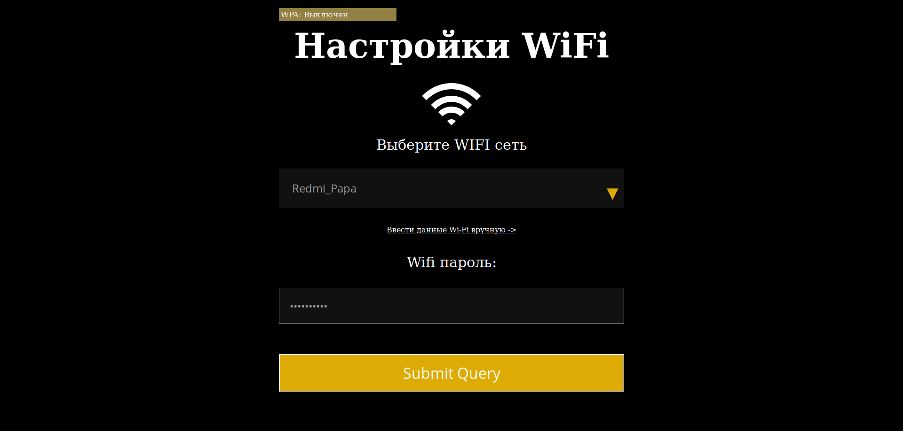
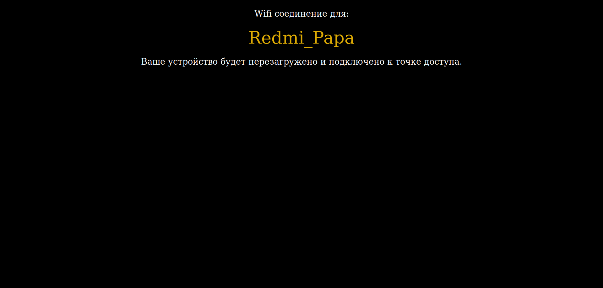

# Настройка стандартной Wi-Fi сети
После включения устройство станет точкой доступа Wi-Fi. Найдите её в списках сетей под названием `SC-SETUP`, и подключитесь к ней:
> Для подключения к сети, необходимо включить поиск Wi-Fi сетей на мобильном телефоне, либо любом устройстве которое
>может подключаться к Wi-Fi

После подключения откройте браузер и введите в адресной строке адрес устройства, для настройки стандартной точки доступа Wi-Fi
`10.0.0.1` или `raspiwifisetup.com` или `idliketoconfigurethewifionthisdevicenowplease.com` (:joy:).

> Выбор сети

Следуйте дальнейшим инструкциям
настройки точки доступа.

> Сообщение о удачном подключении

После удачной настройки устройство самостоятельно перезагрузится с новыми параметрами,
и в случае верной конфигурации -
подключится к указаной ранее точке доступа. В случае, если Wi-Fi соединение будет потеряно,
и не восстановлено в течении 20 минут, устройство перезагрузится в режим настройки.

