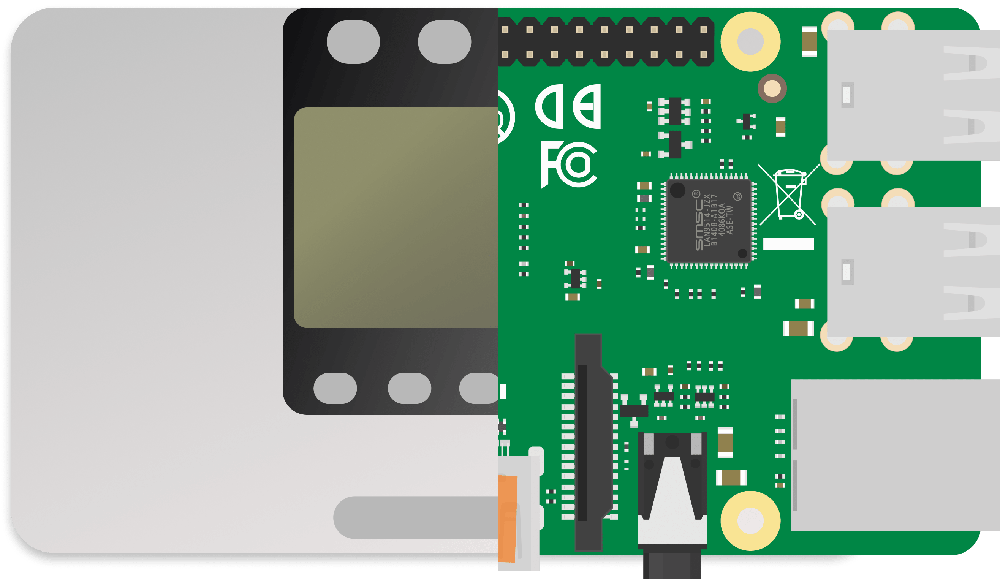

# Преимущества нашего решения на рынке

| Наше решение                                                                                                                                        | Решения конкурентов                                                                                       |
|:----------------------------------------------------------------------------------------------------------------------------------------------------|:----------------------------------------------------------------------------------------------------------|
| Работа с инверторами от нескольких производетелей одновременно                                                                                      | Поддержка инвертора только одного производителя                                                           |
| Работает как удаленно, так и локально, через мессенджер, приложение, веб-кабинет                                                                    | Поддержка до двух видов сбора, контроля информации                                                        |
| Работает со всеми, даже не сертифицироваными устройствами                                                                                           | Зачастую, для использования мониторинга необходим сертифицированый инвертор                               |
| Работает через GSM, Wi-Fi, Ethernet (и даже через Bluetooth)                                                                                        | Поддержка до двух видов подключения                                                                       |
| Программное обеспечение, основнаное на Open Source решениях позволяет выжимать максимум из оборудования, поэтому цена нашей системы - ниже рыночной | Компании собирают дополнительную маржу за свой продукт, заставляя работать с устройствами их прозводства. |
|  Постоянное обновление софта, приносящее новые и новые фичи               |   Зачастую производители проприетарных устройств редко выпускают обновления собственных систем                                                                                                        |

